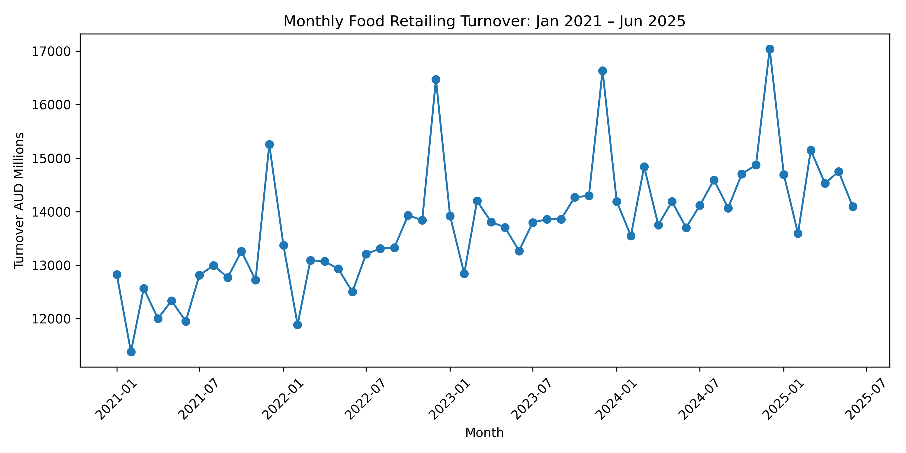
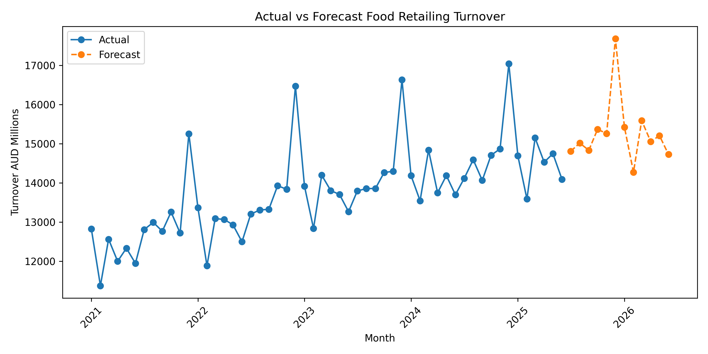
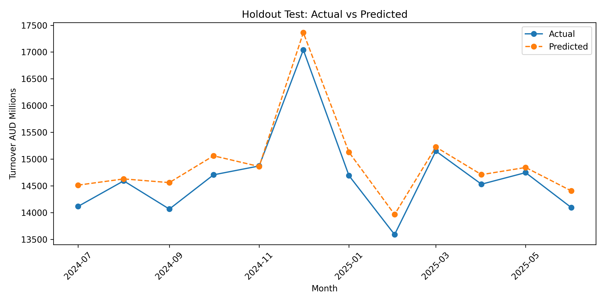
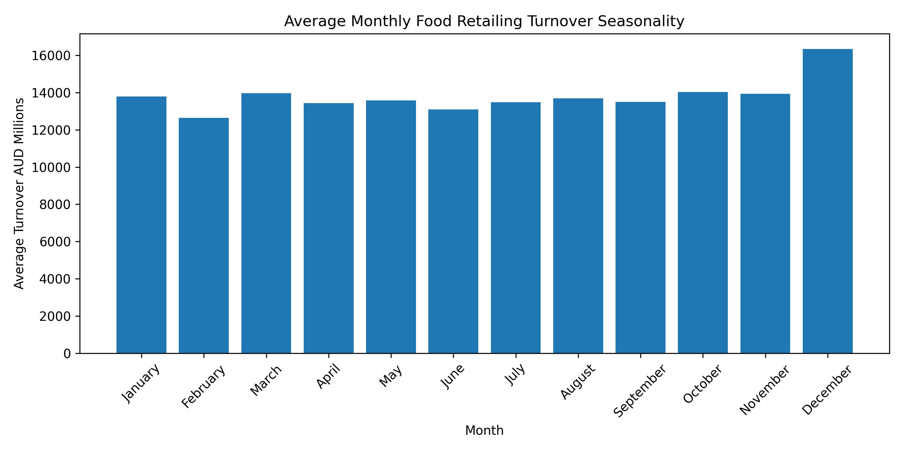

# Woolworths Retail Sales Forecasting

## 📊 Overview
This project applies time series forecasting to predict monthly food retail turnover in Australia, using ABS Retail Trade data. The forecasts support inventory planning, supplier coordination, staffing, and fresh food waste reduction for supermarket chains like Woolworths.

## 🏢 Business Problem
Poor forecasting creates two operational risks:
- **Over-forecasting** → Excess stock → Food waste → Markdown costs
- **Under-forecasting** → Stockouts → Lost sales → Poor customer experience

## 📁 Data
- **Source:** ABS Retail Trade Australia (Category A - Food Retailing)
- **Period:** January 2021 – June 2025 (54 monthly observations)
- **Unit:** AUD millions
- **Target:** Monthly food retailing turnover

| Measure | Value |
| :--- | :--- |
| Observations | 54 months |
| Mean Turnover | AUD 13,753.0 million |
| Minimum Turnover | AUD 11,378.5 million (Feb 2021) |
| Maximum Turnover | AUD 17,040.3 million (Dec 2024) |

## 📈 Key Observations
- **Upward Trend:** Growing consumer spending over time
- **Strong Seasonality:** Consistent December peaks (Christmas)
- **Secondary Peaks:** March–April demand increases

## 🛠️ Methodology
### Model: Holt-Winters Exponential Smoothing (Triple Exponential Smoothing)

**Why this method?**
- Handles trend + seasonality effectively
- Suitable for monthly data with 12-month cycles
- Transparent and explainable for business stakeholders

**Components captured:**
1. **Level** – Base demand
2. **Trend** – Upward movement over time
3. **Seasonal** – 12-month repeating pattern

## 📊 Results
### Model Performance (Holdout Test)
| Metric | Value |
| :--- | :--- |
| **MAPE** | 1.77% |
| **MAE** | 257.48 |
| **RMSE** | 304.1 |

### Forecast (July 2025 – June 2026)
| Month | Forecast (AUD millions) |
| :--- | :--- |
| Jul 2025 | 14,811 |
| Aug 2025 | 15,017 |
| Sep 2025 | 14,834 |
| Oct 2025 | 15,370 |
| Nov 2025 | 15,261 |
| **Dec 2025** | **17,679** ⬆️ Peak |
| Jan 2026 | 15,424 |
| Feb 2026 | 14,273 |
| Mar 2026 | 15,594 |
| Apr 2026 | 15,057 |
| May 2026 | 15,207 |
| Jun 2026 | 14,727 |

### Key Insights
- **Peak Demand:** December 2025 ($17.68B) – plan inventory and staffing
- **Quiet Period:** February 2026 ($14.27B) – reduce orders to avoid waste
- **Average Monthly Forecast:** $15,271M

## 📈 Visualizations               

### Monthly Turnover Trend (Jan 2021 – Jun 2025)


### Actual vs Forecast (Full Timeline)


### Holdout Test: Actual vs Predicted (Last 12 Months)


### Seasonal Pattern: Average Monthly Turnover


## 💰 Business Benefits
### Financial
- Reduced fresh food waste → Cost savings
- Improved gross margins through optimized ordering
- Better cash flow management

### Operational
- Improved supplier relationships
- Better stock availability → Customer satisfaction
- Progress toward sustainability targets (reduced waste)

## 🚀 How to Run
1. Clone this repository
```bash
git clone https://github.com/depneu-1489/woolworths-retail-forecasting.git
